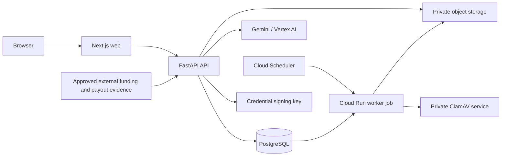

# Architecture

PraxisAI is a transactional modular monolith with separate web, API, and worker deployables. PostgreSQL is the source of truth. The API commits business state and an outbox record in one transaction; a scheduled Cloud Run job claims notification and malware-scan work with bounded retries. Deterministic retention runs in the same worker.

Routes authorize the active membership and call domain services. Domain services own workflow guards, version checks, immutable snapshots, audit records, ledger entries, and outbox events. Agents consume typed inputs and produce typed proposals; they receive no mutation tools.

The MVP remains a modular monolith because the lifecycle shares transactional invariants. Provider protocols are the only distributed boundaries. This avoids premature services without preventing later extraction of agents, files, or analytics workers.
