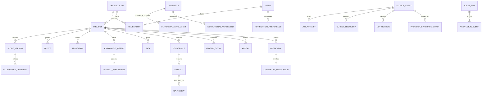

# Data model

All business records use UUID primary keys and UTC timestamps. Foreign keys and frequent filters are indexed. Financial amounts use integer minor units and one ISO currency per quote or ledger transaction.

Scope and quote versions become immutable when sent for approval. Scope-change requests snapshot the accepted quote and released artifact; accepted change orders add explicit funding and compensation entitlements. Offers freeze pay, hours, deadline, revision, lead, and portfolio terms. Audit, transition, payment event, ledger, consent, agent-run, reputation, credential, revocation, job-attempt, and recovery records are append-only; reversals add records instead of deleting evidence.
