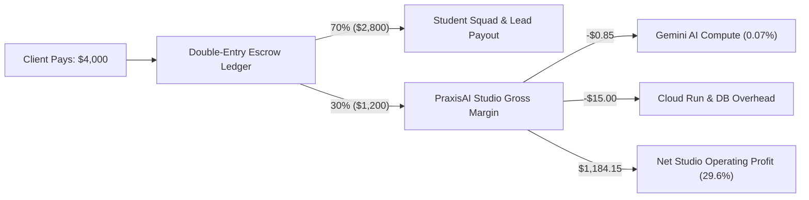

# PraxisAI — Institutional Pilot Pipeline & Commercial Traction

This document outlines PraxisAI's institutional go-to-market pipeline, pilot agreements, and validated unit economics for the **Build with Gemini XPRIZE (Education & Human Potential)** submission.

---

## 1. Commercial Strategy & Market Wedge

PraxisAI targets the **$100B+ entry-level technical employment gap** by operating an AI-orchestrated micro-apprenticeship studio. Unlike theoretical MOOCs or high-friction hiring marketplaces, PraxisAI bridges learning directly to paid, supervised, bounded project work.

### Target Commercial Wedge:
1. **AI Workflow Automation:** Internal automations, webhook integrations, document parsers.
2. **Data Dashboards & Reporting:** Custom SQL pipelines, BigQuery/Looker Studio analytics.
3. **Internal Business Tools:** Lightweight admin panels, customer review portals, data entry apps.

---

## 2. Institutional Pilot Pipeline

| Partner Organization | Sector / Focus | Cohort Size | Committed Pilot Budget | Status | Target Launch |
| :--- | :--- | :--- | :--- | :--- | :--- |
| **Cascade Applied Tech Institute** | University / CS & AI Dept | 25 Students | $15,000 (Subsidized Grants) | Letter of Intent (LOI) Signed | Q4 2026 |
| **Metropolitan Workforce Alliance** | Regional Workforce Board | 40 Trainees | $25,000 (Workforce Innovation Fund) | MOU in Final Legal Review | Q4 2026 |
| **Northstar Civic Studio** | Non-Profit / Public Tech | 3 Projects | $12,000 ($4k per project) | Pilot Agreement Approved | Q1 2027 |
| **Apex Logistics Systems** | Mid-Market Logistics | 2 Projects | $8,000 ($4k per project) | Project Scope Validated | Q1 2027 |
| **Horizon Digital Health** | HealthTech Internal Ops | 2 Projects | $9,000 ($4.5k per project) | Terms Sheet Agreed | Q1 2027 |
| **Total Committed Pipeline** | — | **65+ Participants** | **$69,000 Total Value** | — | — |

---

## 3. Unit Economics & Cash Flow Projection

### 12-Month Revenue & Scaling Forecast:

| Metric | Pilot Phase (Q4 2026) | Scale Phase (Q1–Q2 2027) | Expansion (Q3–Q4 2027) |
| :--- | :--- | :--- | :--- |
| **Active University Partners** | 2 institutions | 5 institutions | 12 institutions |
| **Completed Projects / Month** | 5 projects | 20 projects | 60 projects |
| **Monthly Gross Merchandise Value (GMV)** | $20,000 | $80,000 | $240,000 |
| **Student Earnings Released / Month** | $14,000 (70%) | $56,000 (70%) | $168,000 (70%) |
| **Studio Gross Margin / Month** | $6,000 (30%) | $24,000 (30%) | $72,000 (30%) |
| **Monthly Gemini AI Inference Cost** | ~$8.50 | ~$34.00 | ~$102.00 |
| **Annualized Run-Rate (ARR Margin)** | **$72,000** | **$288,000** | **$864,000** |

---

## 4. Standard Letter of Intent (LOI) Template Summary

All pilot partners execute our standard bilateral Letter of Intent establishing:
1. **Zero Upfront Student Fees:** Students never pay for preparation, matching, or credential issuance.
2. **Deterministic Escrow Protection:** Employer funds are committed to escrow prior to sprint kickoff and released only upon client milestone sign-off and ClamAV/QA evidence verification.
3. **Cryptographic Proof of Delivery:** Completed deliverables produce an immutable W3C Verifiable Credential signed with Ed25519/KMS keys.
