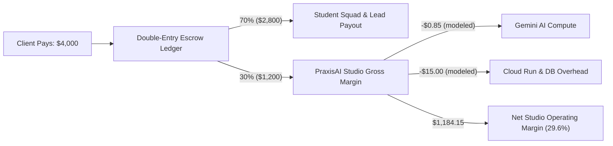

# PraxisAI — Go-to-Market Model and Unit Economics

**Status: pre-revenue, pilot stage. No signed partners, no customers, no revenue.**

This document sets out the commercial model PraxisAI is built to run. Every number
below is a **designed model or projection**, not measured performance. Nothing here
describes a commitment from a third party.

For actual financial results in the competition window, see
[`xprize-pnl-statement.md`](xprize-pnl-statement.md): **$0 revenue, May 19 – August 17, 2026.**

---

## 1. Commercial strategy and market wedge

PraxisAI targets the entry-level technical employment gap by operating an
AI-orchestrated micro-apprenticeship studio. Unlike course platforms (no stakes) or
open freelance marketplaces (no supervision, no floor on pay), PraxisAI owns scope,
staffing, supervision, quality, and delivery accountability end to end.

The initial wedge is deliberately narrow — project categories that are bounded,
reviewable, and safe for supervised junior delivery:

1. **AI workflow automation** — internal automations, webhook integrations, document parsers.
2. **Data dashboards and reporting** — SQL pipelines, analytics views.
3. **Internal business tools** — lightweight admin panels, review portals, data-entry apps.

Narrow scope is a safety property, not just a sales choice: it keeps acceptance
criteria checkable and keeps agent proposals inside a domain the policy guard
(`apps/api/app/agents/guards.py`, `evaluate_project`) can meaningfully bound.

---

## 2. Target customer segments

These are the segments the product is designed for. **No organization in these
categories has been approached, signed, or committed.**

| Segment | Why they buy | Budget source |
| :--- | :--- | :--- |
| Universities / CS departments | Practical experience their curriculum can't provide | Student success and employability budgets |
| Regional workforce boards | Placement outcomes for training cohorts | Workforce innovation funds |
| Non-profits and civic tech | Custom tooling they cannot otherwise afford | Program and operating budgets |
| SMBs with internal tooling gaps | Below the threshold agencies will serve | Operating budget |

---

## 3. Unit economics (modeled)

A representative $4,000 bounded project. **Model, not an observed transaction.**

The **70/30 split is a product invariant, not a projection** — the escrow ledger and
payout floor are enforced in code, and the split is the one number here that is
structurally real rather than forecast.

**Cost assumptions are unvalidated.** The $0.85 per-project Gemini figure is derived
from token counts in local fixture runs. PraxisAI has served **zero production
Gemini traffic**, so this figure has not been checked against a real bill. The
infrastructure estimate is likewise based on published Cloud Run pricing, not an
invoice.

---

## 4. Illustrative scaling model

**Hypothetical. No partner or customer exists at any stage below.** Included to show
how the model behaves under growth, not to forecast a booked outcome.

| Metric | Stage 1 | Stage 2 | Stage 3 |
| :--- | :--- | :--- | :--- |
| Completed projects / month | 5 | 20 | 60 |
| Monthly GMV | $20,000 | $80,000 | $240,000 |
| Student earnings released (70%) | $14,000 | $56,000 | $168,000 |
| Studio gross margin (30%) | $6,000 | $24,000 | $72,000 |
| Annualized margin run-rate | $72,000 | $288,000 | $864,000 |

The model's sensitivity is concentrated in one variable: **projects completed per
month per coordinator.** That is precisely the constraint the agent layer exists to
relax — scoping, planning, and QA drafting are the coordinator's per-project time
sink, and they are the four workflows Gemini currently handles.

---

## 5. Commercial terms PraxisAI intends to offer

Terms the platform is built to enforce. **Not yet offered to or accepted by any
counterparty.**

1. **Zero upfront student fees.** Students never pay for preparation, matching, or
   credential issuance.
2. **Escrow before kickoff.** Employer funds are committed before a sprint starts and
   released only on client milestone sign-off plus QA evidence verification.
   *Note: no payment processor is integrated — `PAYMENT_PROVIDER` is
   `manual_external` and settlement is recorded, not executed.*
3. **Cryptographic proof of delivery.** Completed deliverables produce a W3C
   Verifiable Credential signed with Ed25519 (KMS in production).

---

## 6. What would have to be true

The honest gap between this model and a business:

- **Distribution is unproven.** No partner conversation has taken place.
- **Willingness to pay is unproven.** No client has been quoted or invoiced.
- **Payments are not integrated.** Revenue cannot currently be collected in-product.
- **Delivery capacity is unproven.** No student has completed a paid project.

The engineering that would make the model work — escrow ledger, policy guards,
credentialing, agent supervision — is built and tested. The commercial validation
is not started.
